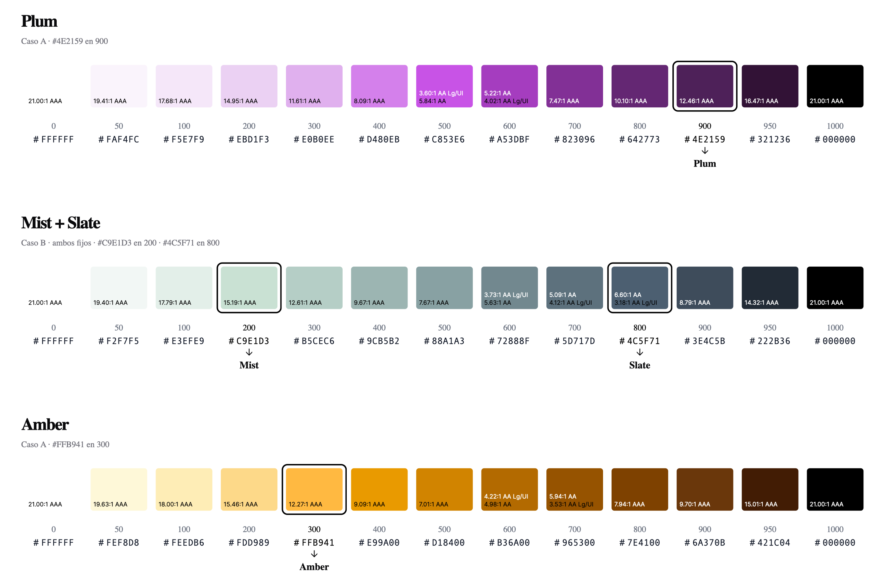

# Color Scales

English · [Español](README.es.md)

**A brand rarely arrives with a scale: it arrives with colors chosen for identity, not for a system.**

Color Scales turns a brand's palette into a set of scales that are consistent with each other, ready to be used together in a design system.



## Why it exists

Five or six brand colors are almost never six scales. There are usually two that share a hue and only differ in lightness: an aqua green and a petrol green, an amber and a brown. Are they one scale or two? Testing it meant building scales by hand, or choosing which step each color went to and adjusting until it worked.

Color Scales solves it in one line: it fixes both colors, places each one at its level and tells whether they should be merged or split. When they are merged, the scale shifts the hue slightly between the light and the dark color instead of doubling up over subtle differences.

## What makes it different

- **It reads each color's lightness and places it at its level.** A dark color goes to 900; a light one, to 300. Every scale follows the same curve, so red 600 and blue 600 have the same lightness: they combine into one system and the contrast between them is predictable.
- **Two fixed colors in one scale, with a verdict.** If they belong to the same family, they share a scale; if not, it also delivers the two separate scales.
- **Brand colors stay marked.** Each input color is highlighted at its level, with a border, an arrow and its name: the originals are visible at a glance, with no need to mark them by hand in Figma.
- **Extremes you can actually use.** The hue shifts when lightening and darkening, as in the Tailwind palettes: dark yellows don't turn olive and light tints keep their identity.

## When it helps

- Designing a digital product for a brand that already exists.
- Creating a brand: the main palette and its scales are defined together from the start.

## In 30 seconds

```
4E2159
caso b C9E1D3 4C5F71
```

One scale per line. The result is an SVG to paste into Figma, with the 13 levels (`0 50 100 … 900 950 1000`) and the WCAG contrast on each swatch.

The input keywords are in Spanish (`caso` = case, `fijo oscuro` = fixed dark, `ambos` = both), and so are the skill instructions and the labels in the output.

<details open>
<summary><h2>All input options</h2></summary>

One color or one pair of colors per line, with or without `#`:

```
4E2159
caso b C9E1D3 4C5F71
caso b E8F4F1 C9E1D3 fijo oscuro
caso c 592E63 9B7FA3
FFB941@400
```

| Line | Result |
|---|---|
| `4E2159` | Single-color scale, placed by its lightness |
| `caso b A B` | Both colors fixed in one scale; if it is not recommended, two separate scales as well |
| `caso b A B fijo oscuro` | Only one fixed color; the step closest to the other one, marked and compared |
| `caso b A B ambos` | Merges both colors even if they are very different |
| `caso c A B` | Gradient from A (level 0) to B (level 1000) |
| `HEX@400` | Forces the level of a color |

Several scales can be requested at once, one per line.

</details>

<details open>
<summary><h2>How to read the result</h2></summary>

The SVG is copied to the clipboard to paste into Figma with Cmd+V, and is also saved as a file, with a preview.

- **Original colors:** highlighted in black and labeled with a name, centered on their swatch.
- **Contrast:** at the bottom left of each swatch, the color's contrast with white text and with black text according to WCAG 2.1, each in its own color and only when it is usable: `AA Lg/UI` (3:1, large text and icons or borders), `AA` (4.5:1, normal text) or `AAA` (7:1). It works both ways: the same line tells whether white text works on the color and whether the color works as text or an icon on a white background (and the same with black).
- **Not recommended scale:** when two colors should not share a scale, their colors and note are marked in red, and the two separate scales that replace it carry ↳ in their title.
- **On request:** a table with HEX, OKLCH and contrast values, or a report of the level from which each scale meets the minimum contrast for text.

</details>

<details open>
<summary><h2>Export</h2></summary>

Each scale carries a short code in its title (`01`, `02`…). When asked to export, the skill shows every scale from the conversation on one sheet, suggests a selection (the latest version of each color and, for a scale that is not recommended, its two separate scales) and asks which ones to export, in which formats, and whether in HEX or OKLCH:

| Format | File | For |
|---|---|---|
| SVG | `.svg` | Pasting into Figma |
| CSS variables | `.css` | `--color-plum-500: #c853e6;` |
| Tokens | `.tokens.json` | DTCG 2025.10 standard format, for token tools |
| Config | `.config.json` | Regenerating exactly the same scales |

Each conversation gets its own folder in Downloads (`~/Downloads/colorscales_2026-10-07_1942/`), holding its runs and exports. The exported SVG is clean: just the name of each scale.

</details>

<details open>
<summary><h2>How it is built</h2></summary>

The math runs in OKLCH, a color space where numeric changes match perceived changes, and contrast is measured with the WCAG 2.1 formula. The lightness of each level, the hue shift when lightening and darkening, and the saturation at the extremes are calibrated with the Tailwind CSS v4.3 palettes. When a requested color does not exist on screen, its saturation is reduced without changing its hue or lightness. The compatibility of two colors is measured as perceptual distance in OKLab. The scale is computed by a script: the same input always produces the same result.

</details>

<details open>
<summary><h2>Installation</h2></summary>

It is a Claude skill. In Claude Code, clone the repository into the skills folder under the skill's name:

```
git clone https://github.com/MarchuGit/color-scales.git ~/.claude/skills/m-color-scales
```

For a claude.ai account, compress the folder into a `.zip` and upload it in the skills settings. Requires Python 3. Copying to the clipboard (`pbcopy`) and the preview (Quick Look and Pillow) work on macOS; on other systems the SVG is still saved as a file.

```
SKILL.md                         instructions for Claude
scripts/color_scale.py           engine and SVG templates
docs/example.png                 example image
```

</details>

<details open>
<summary><h2>Limits</h2></summary>

It does not choose a brand's colors or replace visual judgment in borderline cases: the recommendation to merge or split a scale uses guideline thresholds. The preview uses fallback fonts; the SVG keeps the design's typefaces (Geist and Andale Mono). It does not yet generate dark mode or tinted neutrals.

</details>

## Credits and license

The lightness curve, the hue shift and the saturation falloff at the extremes were calibrated with the color palette of [Tailwind CSS](https://tailwindcss.com) v4.3, by Tailwind Labs, Inc., released under the MIT license.

[MIT](LICENSE) © 2026 Marcela Gómez
